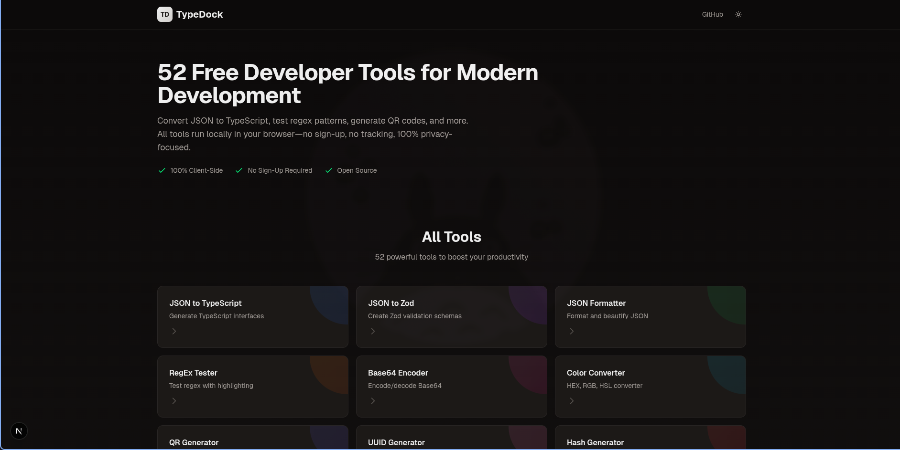
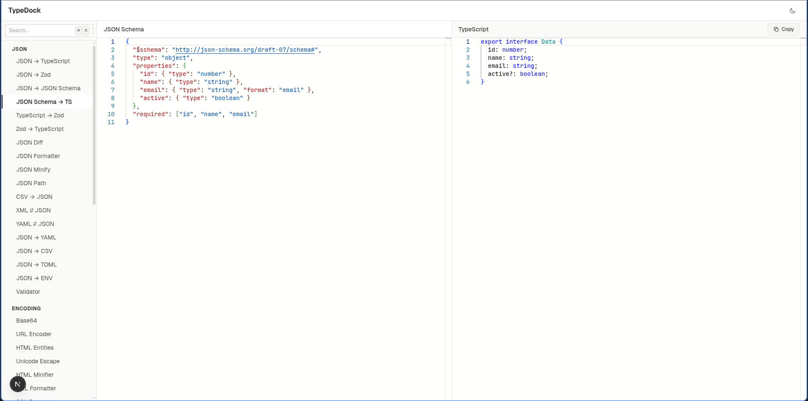
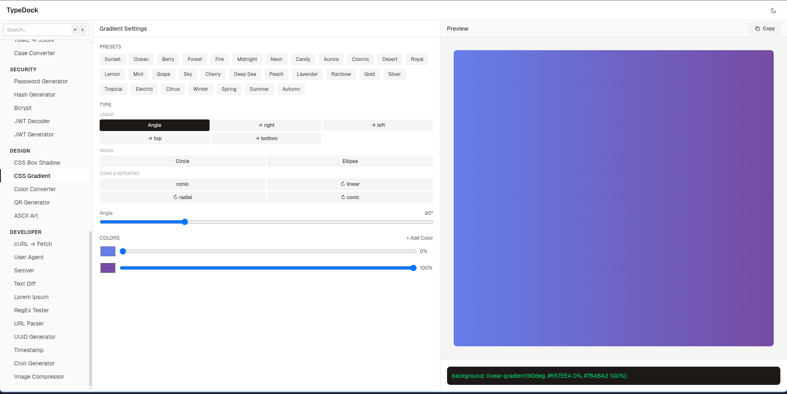
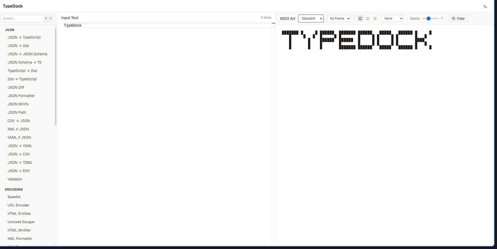
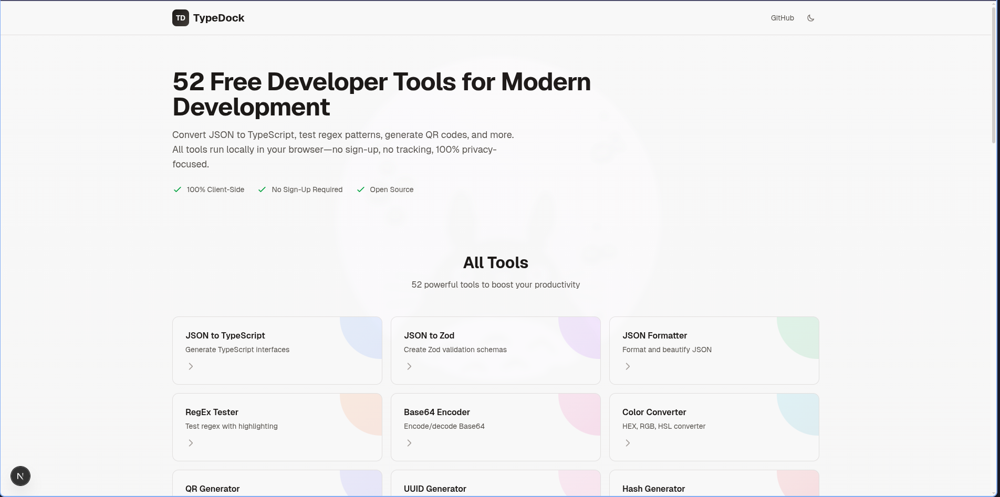

# TypeDock

52 free developer tools for modern development. All tools run 100% client-side in your browser.

**Live Site:** https://typedock.vercel.app

## Screenshots


*Homepage with all 52 tools*


*JSON to TypeScript converter with Monaco editor*


*Visual CSS gradient builder*


*Text to ASCII art converter*


*Clean light mode interface*

## Features

- 100% client-side processing - your data never leaves your browser
- No sign-up or authentication required
- No tracking or analytics
- Dark mode support
- Keyboard shortcuts
- Clean, minimal UI
- Open source

## Tools

### JSON Tools
- JSON to TypeScript - Generate TypeScript interfaces
- JSON to Zod - Create Zod validation schemas
- JSON Formatter - Format and beautify JSON
- JSON Minify - Compress JSON size
- JSON Diff - Compare JSON objects
- JSON Path - Query JSON with expressions
- JSON to CSV - Export JSON to CSV
- JSON to YAML - Convert to YAML format
- JSON to TOML - Convert to TOML format
- JSON to ENV - Generate environment variables
- JSON to JSON Schema - Generate JSON Schema
- JSON Schema to TypeScript - Convert schemas to types

### Converters
- Base64 Encoder/Decoder
- URL Encoder/Decoder
- Base Converter - Binary, Octal, Decimal, Hex
- Case Converter - camelCase, snake_case, kebab-case
- Markdown to HTML
- HTML to Markdown
- CSV to JSON
- XML to JSON
- YAML to JSON
- TOML to JSON
- HTML Entities Encoder/Decoder
- Unicode Escape

### Security
- Password Generator
- Hash Generator - MD5, SHA-256, SHA-512
- Bcrypt - Hash and verify passwords
- JWT Decoder
- JWT Generator

### Developer Tools
- RegEx Tester
- SQL Formatter
- XML Formatter
- HTML Minifier
- Text Diff
- URL Parser
- User Agent Parser
- Semver Checker
- Cron Generator
- cURL to Fetch
- Timestamp Converter
- UUID Generator (v1, v4, v7)
- Lorem Ipsum Generator

### Design Tools
- Color Converter - HEX, RGB, HSL
- QR Code Generator
- ASCII Art Generator
- CSS Box Shadow Generator
- CSS Gradient Generator
- Image Compressor

### Validation
- Zod Validator
- TypeScript to Zod
- Zod to TypeScript

## Tech Stack

- Next.js 15
- React 19
- TypeScript
- Tailwind CSS
- Monaco Editor

## Getting Started

```bash
# Clone the repository
git clone https://github.com/yoni-crypto/typedock.git

# Install dependencies
npm install

# Run development server
npm run dev

# Build for production
npm run build
```

## Contributing

Contributions are welcome! Please read [CONTRIBUTING.md](CONTRIBUTING.md) for guidelines.

### How to Contribute

1. Fork the repository
2. Create a feature branch (`git checkout -b feature/new-tool`)
3. Commit your changes (`git commit -m 'Add new tool'`)
4. Push to the branch (`git push origin feature/new-tool`)
5. Open a Pull Request

### Adding a New Tool

1. Create a new directory in `app/[tool-name]/`
2. Add `page.tsx` with the tool UI
3. Add `layout.tsx` with SEO metadata
4. Create utility functions in `lib/utils/`
5. Add the tool to homepage and sidebar
6. Update sitemap and metadata

## License

MIT License - see [LICENSE](LICENSE) for details

## Support

- GitHub Issues: https://github.com/yoni-crypto/typedock/issues
- Website: https://typedock.vercel.app

## Acknowledgments

Built with Next.js and deployed on Vercel.
